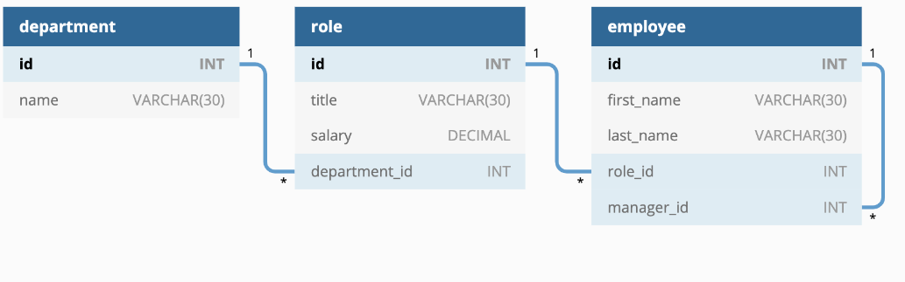
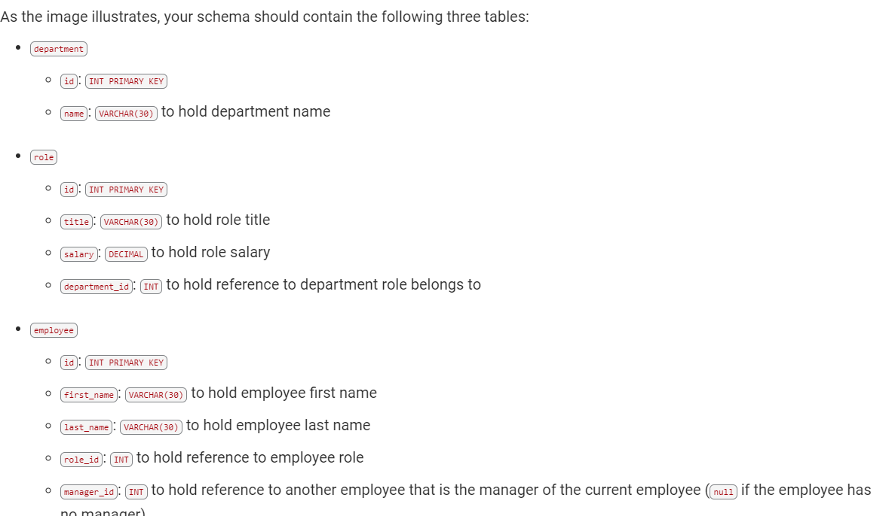

# Employee Tracker (MySQL)

## Description 
For this module we were asked to build a CLI (command lin interface) for managing a company's employees using node, inquirer, and MySQL.

## Key Features
* Application Application uses the inquirer package available from [npm inquirer](https://www.npmjs.com/package/inquirer) that allows for the command line prompts and users responses to populated on screen and into the database.
* Application uses the MySQL package available from [npm MySQL2](https://www.npmjs.com/package/mysql2) to connect to the MySQL database.
* Application also uses the [npm console.table](https://www.npmjs.com/package/console.table) to create tables in the CLI
* User can add departments, roles and employees
* Users can view departments, roles and employees
* User can update the employees roles

### Walk through Video
The following video demonstrates the applications functionality.
[Video link]()

### ScreenShots
Design the database schema as shown in the following image:

This is an image with the proper structure of what the three tables should contain

